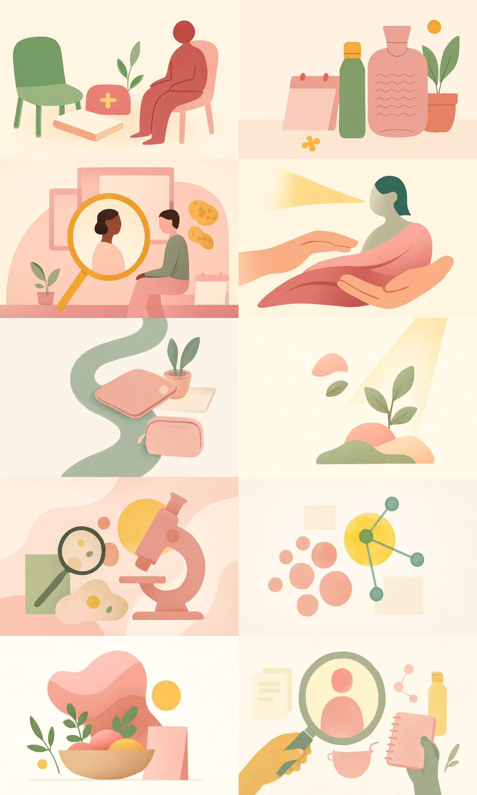

# Blog Header Generator for Endo Health

A system for generating visually consistent blog header illustrations from article titles using structured prompt engineering and OpenAI's image generation API.

The target brand is [Endo Health](https://endometriose.app), a German digital health company focused on endometriosis. Their blog publishes articles across topics such as research, nutrition, mental health, rehabilitation, and advocacy. Each article requires a header image that reflects its topic while remaining visually consistent with the rest of the site.


Example batch of generated blog headers.

## Pipeline

**1. Title classification.** Each blog title is matched against keyword lists and assigned to a topic category: `research`, `pain`, `movement`, `nutrition`, `community`, `advocacy`, `diagnosis`, `fertility`, `treatment`, `mental_wellbeing`, `reha`, or `daily_life`. This determines which visual vocabulary the prompt draws from.

**2. Metaphor selection.** Each category maps to a pool of visual metaphors. A research article might get "microscope-inspired abstract forms with floating organic elements." A community article might get "two chairs and a shared table suggesting dialogue." One is picked at random per image.

**3. Object sampling.** Small sets of supporting props are drawn from category-specific pools. Research gets magnifying glasses and connected nodes. Comfort gets tea cups and heating pads. Nutrition gets bowls and herbs. This keeps the props relevant without overcrowding the composition.

**4. Composition assignment.** A layout template is chosen from options like "object-centered still life," "pathway metaphor," or "layered collage." The system tracks which compositions have been used in the current batch and favors less-used ones. 

**5. Prompt assembly.** Everything above is combined with shared style constraints (flat illustration, brand palette, left-third whitespace for text overlay, no text in the image, gender-neutral figures) into a single prompt. The image model gets a detailed, bounded creative brief.


Every prompt inherits the same base: flat 2D editorial illustration, paper-grain texture, specific hex colors (#F5C518 gold accent, #E8A0BF blush, #9CAF88 sage), landscape format, generous whitespace. These rules are immutable across the batch.

The metaphor, objects, composition, and color balance are randomized per image, but only within predefined pools. The creative space is wide enough for variety, narrow enough for coherence.

The composition selector tracks usage counts across the batch. If "still life" has already been used twice, the system will prefer "pathway metaphor" or "interior scene" for the next image.

## Inclusivity

Endometriosis affects people of all gender identities, not only women. The prompt system reflects this throughout:

- Human figures are abstract, faceless, and gender-neutral when they appear
- Reproductive organ imagery is avoided by default (only permitted when a title explicitly names a specific organ, and even then minimizes such imagery)
- The negative style list bans gendered body shapes and pink-equals-female color assumptions
- Many images use object-based or abstract compositions with no human figure at all

## Project structure

```
endo-header-generator/
├── generate_headers.py   # CLI: scrape, classify, prompt, generate, export
├── app.py                # Streamlit UI with prompt inspector
├── config.py             # Style rules, categories, prompt components
├── utils.py              # Scraping, classification, prompt assembly, API calls
├── requirements.txt
└── output/
    ├── header_01.png ... header_10.png
    ├── contact_sheet.png
    ├── gallery.html
    └── REPORT.md
```

## Setup

```bash
git clone https://github.com/ciwwwnd/endo-header-generator.git
cd endo-header-generator
pip install -r requirements.txt
export OPENAI_API_KEY="sk-..."
```

Requires Python 3.9+ and an OpenAI API key with access to `gpt-image-1`.

## Usage

### Batch generation

```bash
python generate_headers.py
```

Scrapes 10 random titles from the Endo Health blog, generates headers, and writes results to `output/`. Open `output/gallery.html` to review.

### Streamlit demo

```bash
streamlit run app.py
```

Pick titles from a dropdown, inspect the full prompt with all its metadata (category, metaphor, objects, composition), and generate images interactively. Includes session-level rate limiting.

## Cost

Uses `gpt-image-1` at `low` quality, `1536x1024`. A 10-image batch runs roughly $0.10 to $0.30 at current OpenAI pricing.
