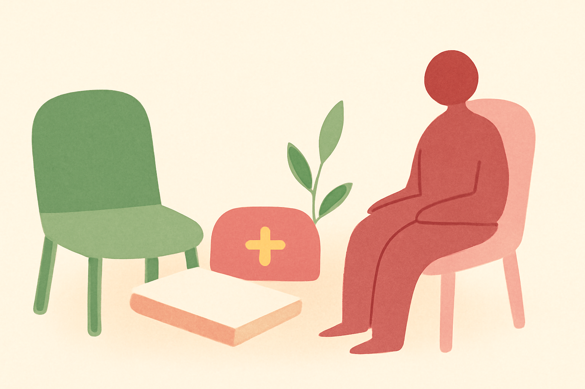
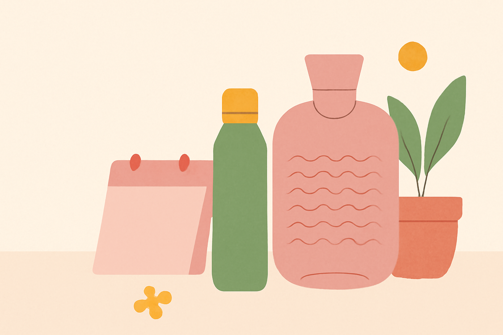
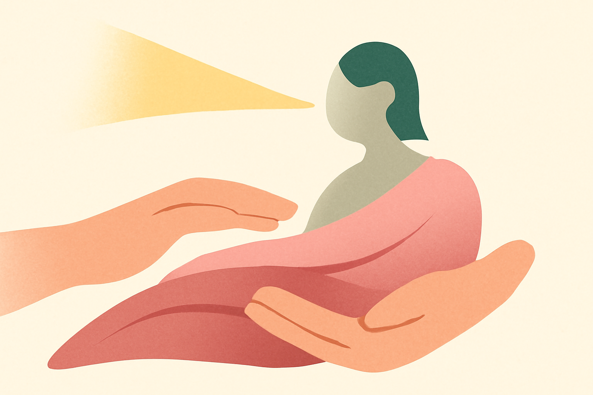
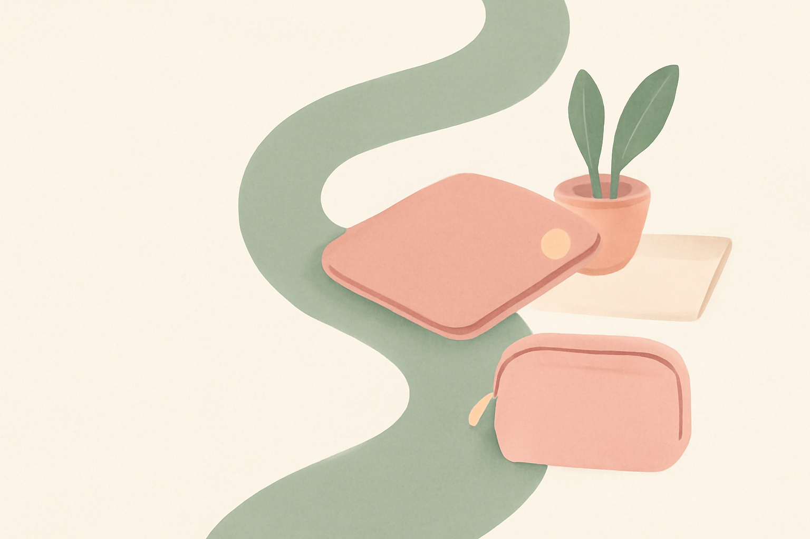
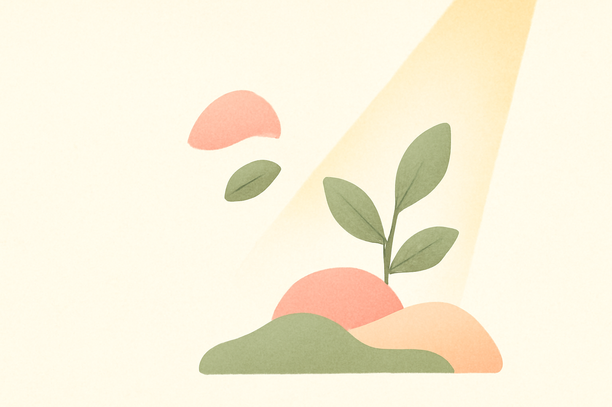
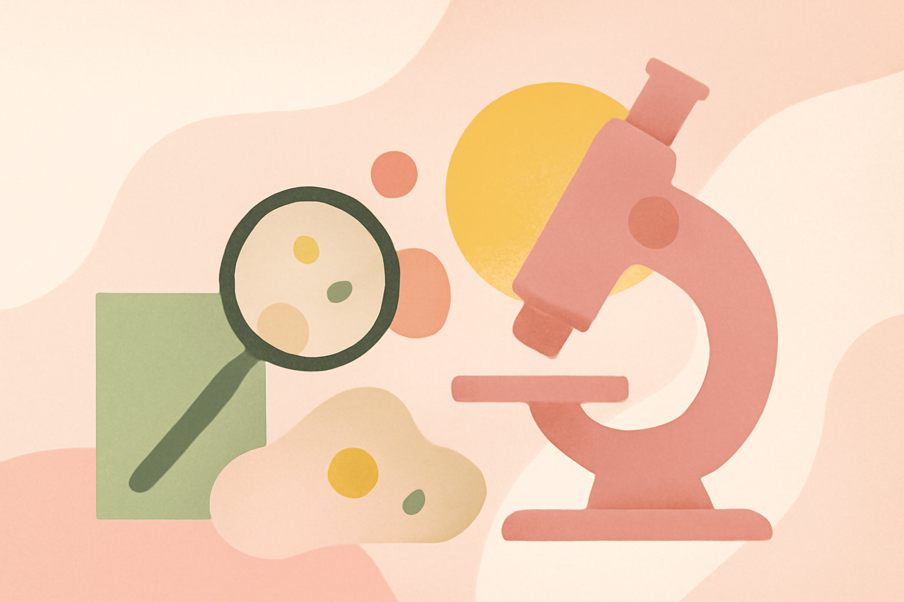
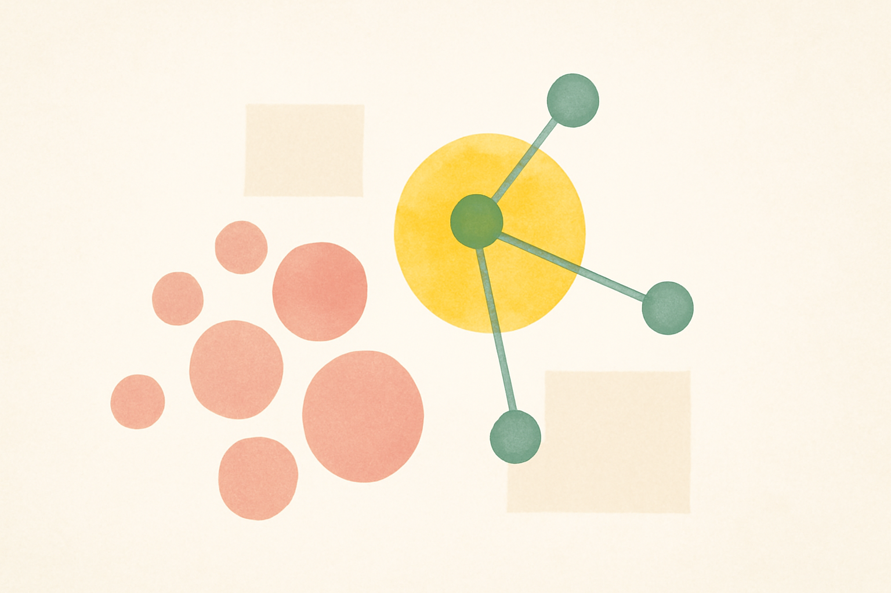
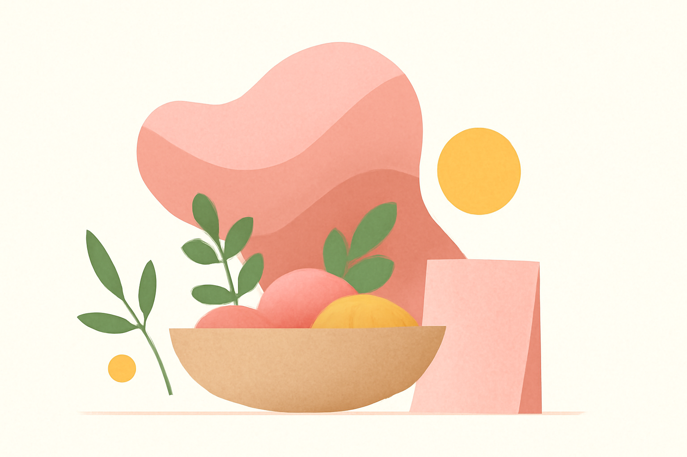
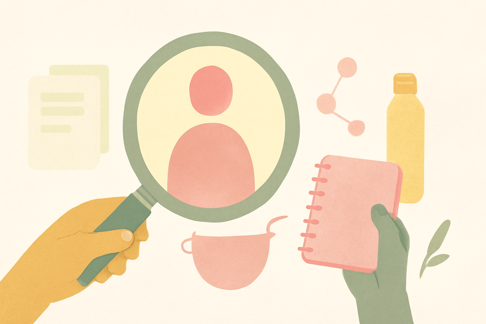

# Endo Health – Blog Header Generation Report

Generated: 2026-03-09 18:38
Model: gpt-image-1 | Size: 1536x1024 | Quality: low

## 1. Endometriose auf Social Media: Was sollte ich beachten?

Status: ok

Category: community
Metaphor pool: connection
Composition: abstract symbolic editorial scene
Color balance: sage and cream dominant with soft dusty rose accents
Objects: notebook, small medicine pouch

Prompt:

```text
Create a wide editorial header illustration for a health blog about
endometriosis. The blog is inclusive and addresses all people affected by
endometriosis, not only women.

Visual style:
Modern flat editorial illustration with subtle paper-like grain texture,
soft gradients, rounded organic shapes, minimal but warm, calm and airy.
Not photorealistic, not 3D, not glossy.

Brand palette:
Cream white, dusty rose / blush pink (#E8A0BF), sage green (#9CAF88),
and warm golden yellow (#F5C518) only as a restrained accent.
Yellow must not dominate. No cold blues, no harsh reds, no dark tones.

Composition:
Landscape format. Generous whitespace. One clear focal idea, not crowded.

Style constraints:
Flat 2D editorial illustration only.
No 3D rendering, no pseudo-3D product mockup look, no clay style, no realistic shading.
Soft flat color fields with minimal tonal variation.
Poster-like or paper-cut layering is acceptable.

Do not include any readable text, letters, numbers, labels, handwriting,
month names, calendar text, document text, or typographic marks anywhere.
All documents, calendars, score sheets, labels, and cards must be completely
blank — no grid lines, no cell borders, no symbols. Show them as simple
flat colored rectangles only.

Reserve the left third as quiet negative space for headline text overlay.
The main focal element must sit in the center or right portion.
Do not place dense detail, faces, or key objects in the left third.

Use one clear focal element and at most two or three supporting elements.
Avoid catalog-like object arrangements.
Avoid evenly spacing many objects across the frame.

Human figure rule:
If a human figure appears, it must be simplified, abstract, and faceless
(no eyes, nose, or mouth). Use gender-neutral body shapes — avoid
emphasizing breasts, narrow waists, or other gendered features.
Figures should feel universal: they could be anyone affected by endometriosis.

Do NOT show a person clutching or holding their stomach or abdomen.
Vary poses: sitting, reading, walking, stretching, resting, conversing.
Many images should have no human figure at all — prefer object-based or
abstract compositions when possible.

Article: "Endometriose auf Social Media: Was sollte ich beachten?"

Category: community

Anatomy directive:

Do NOT include any uterus, ovary, fallopian tube, or reproductive organ symbol anywhere in this image. Not even as a small background element. Use indirect metaphor, abstract shapes, or objects instead.

Creative direction:

Composition type: abstract symbolic editorial scene.

Main metaphor: care and understanding represented by warm proximity of objects.

Supporting elements (use only these): notebook, small medicine pouch.

use botanical elements very sparingly (one small leaf or stem).

Color balance: sage and cream dominant with soft dusty rose accents.

Shared space: paired objects, chairs, notebooks, warm meeting atmosphere. No anatomy.

Avoid all of the following:
- Uterus or reproductive organ icon (use abstract metaphors instead)
- Centered female profile with halo or sun behind head
- Explicitly gendered body shapes (breasts, narrow waist, curvy hips)
- Person clutching their stomach (overused and triggering)
- Thick ribbon crossing the whole image
- Mirrored leaf clusters on both sides
- Monochrome yellow wash
- Any readable text, month names, grid lines on calendars
- 3D render, clay illustration, or product mockup look
- Symmetrical poster composition
- Too many props or cluttered scene
- Generic stock wellness aesthetic
- Pink-equals-female color coding
```



---

## 2. Wann kann ich welche Vorsorgeuntersuchungen machen lassen?

Status: ok

Category: daily_life
Metaphor pool: routine
Composition: object-centered still life
Color balance: cream and blush dominant, yellow accent only
Objects: water bottle, potted plant, heating-pad form

Prompt:

```text
Create a wide editorial header illustration for a health blog about
endometriosis. The blog is inclusive and addresses all people affected by
endometriosis, not only women.

Visual style:
Modern flat editorial illustration with subtle paper-like grain texture,
soft gradients, rounded organic shapes, minimal but warm, calm and airy.
Not photorealistic, not 3D, not glossy.

Brand palette:
Cream white, dusty rose / blush pink (#E8A0BF), sage green (#9CAF88),
and warm golden yellow (#F5C518) only as a restrained accent.
Yellow must not dominate. No cold blues, no harsh reds, no dark tones.

Composition:
Landscape format. Generous whitespace. One clear focal idea, not crowded.

Style constraints:
Flat 2D editorial illustration only.
No 3D rendering, no pseudo-3D product mockup look, no clay style, no realistic shading.
Soft flat color fields with minimal tonal variation.
Poster-like or paper-cut layering is acceptable.

Do not include any readable text, letters, numbers, labels, handwriting,
month names, calendar text, document text, or typographic marks anywhere.
All documents, calendars, score sheets, labels, and cards must be completely
blank — no grid lines, no cell borders, no symbols. Show them as simple
flat colored rectangles only.

Reserve the left third as quiet negative space for headline text overlay.
The main focal element must sit in the center or right portion.
Do not place dense detail, faces, or key objects in the left third.

Use one clear focal element and at most two or three supporting elements.
Avoid catalog-like object arrangements.
Avoid evenly spacing many objects across the frame.

Human figure rule:
If a human figure appears, it must be simplified, abstract, and faceless
(no eyes, nose, or mouth). Use gender-neutral body shapes — avoid
emphasizing breasts, narrow waists, or other gendered features.
Figures should feel universal: they could be anyone affected by endometriosis.

Do NOT show a person clutching or holding their stomach or abdomen.
Vary poses: sitting, reading, walking, stretching, resting, conversing.
Many images should have no human figure at all — prefer object-based or
abstract compositions when possible.

Article: "Wann kann ich welche Vorsorgeuntersuchungen machen lassen?"

Category: daily_life

Anatomy directive:

Do NOT include any uterus, ovary, fallopian tube, or reproductive organ symbol anywhere in this image. Not even as a small background element. Use indirect metaphor, abstract shapes, or objects instead.

Creative direction:

Composition type: object-centered still life.

Main metaphor: practical self-care shown through an organized still life.

Supporting elements (use only these): water bottle, potted plant, heating-pad form.

use small rounded symbolic accents.

Color balance: cream and blush dominant, yellow accent only.

Practical self-care or home routine metaphors. Minimal and editorial.

Avoid all of the following:
- Uterus or reproductive organ icon (use abstract metaphors instead)
- Centered female profile with halo or sun behind head
- Explicitly gendered body shapes (breasts, narrow waist, curvy hips)
- Person clutching their stomach (overused and triggering)
- Thick ribbon crossing the whole image
- Mirrored leaf clusters on both sides
- Monochrome yellow wash
- Any readable text, month names, grid lines on calendars
- 3D render, clay illustration, or product mockup look
- Symmetrical poster composition
- Too many props or cluttered scene
- Generic stock wellness aesthetic
- Pink-equals-female color coding
```



---

## 3. Was ist tief infiltrierende Endometriose?

Status: ok

Category: diagnosis
Metaphor pool: clarity
Composition: interior wellness scene
Color balance: blush and cream dominant with small golden highlights
Objects: abstract cells, magnifying glass

Prompt:

```text
Create a wide editorial header illustration for a health blog about
endometriosis. The blog is inclusive and addresses all people affected by
endometriosis, not only women.

Visual style:
Modern flat editorial illustration with subtle paper-like grain texture,
soft gradients, rounded organic shapes, minimal but warm, calm and airy.
Not photorealistic, not 3D, not glossy.

Brand palette:
Cream white, dusty rose / blush pink (#E8A0BF), sage green (#9CAF88),
and warm golden yellow (#F5C518) only as a restrained accent.
Yellow must not dominate. No cold blues, no harsh reds, no dark tones.

Composition:
Landscape format. Generous whitespace. One clear focal idea, not crowded.

Style constraints:
Flat 2D editorial illustration only.
No 3D rendering, no pseudo-3D product mockup look, no clay style, no realistic shading.
Soft flat color fields with minimal tonal variation.
Poster-like or paper-cut layering is acceptable.

Do not include any readable text, letters, numbers, labels, handwriting,
month names, calendar text, document text, or typographic marks anywhere.
All documents, calendars, score sheets, labels, and cards must be completely
blank — no grid lines, no cell borders, no symbols. Show them as simple
flat colored rectangles only.

Reserve the left third as quiet negative space for headline text overlay.
The main focal element must sit in the center or right portion.
Do not place dense detail, faces, or key objects in the left third.

Use one clear focal element and at most two or three supporting elements.
Avoid catalog-like object arrangements.
Avoid evenly spacing many objects across the frame.

Human figure rule:
If a human figure appears, it must be simplified, abstract, and faceless
(no eyes, nose, or mouth). Use gender-neutral body shapes — avoid
emphasizing breasts, narrow waists, or other gendered features.
Figures should feel universal: they could be anyone affected by endometriosis.

Do NOT show a person clutching or holding their stomach or abdomen.
Vary poses: sitting, reading, walking, stretching, resting, conversing.
Many images should have no human figure at all — prefer object-based or
abstract compositions when possible.

Article: "Was ist tief infiltrierende Endometriose?"

Category: diagnosis

Anatomy directive:

Do NOT include any uterus, ovary, fallopian tube, or reproductive organ symbol anywhere in this image. Not even as a small background element. Use indirect metaphor, abstract shapes, or objects instead.

Creative direction:

Composition type: interior wellness scene.

Main metaphor: recognition through layered windows and focus shapes.

Supporting elements (use only these): abstract cells, magnifying glass.

use gentle curved forms in the background.

Color balance: blush and cream dominant with small golden highlights.

Diagnostic framing: focus shapes, magnifying glass, spotlight, layered windows. Prefer abstract body outlines over literal organ diagrams.

Avoid all of the following:
- Uterus or reproductive organ icon (use abstract metaphors instead)
- Centered female profile with halo or sun behind head
- Explicitly gendered body shapes (breasts, narrow waist, curvy hips)
- Person clutching their stomach (overused and triggering)
- Thick ribbon crossing the whole image
- Mirrored leaf clusters on both sides
- Monochrome yellow wash
- Any readable text, month names, grid lines on calendars
- 3D render, clay illustration, or product mockup look
- Symmetrical poster composition
- Too many props or cluttered scene
- Generic stock wellness aesthetic
- Pink-equals-female color coding
```


---

## 4. Periode und Regelschmerzen: Was ist normal? Was nicht?

Status: ok

Category: pain
Metaphor pool: relief
Composition: hands-based composition (simplified, faceless hands only)
Color balance: cream and blush dominant, yellow accent only
Objects: light beam, abstract body outline (could be any person), blanket-like shapes

Prompt:

```text
Create a wide editorial header illustration for a health blog about
endometriosis. The blog is inclusive and addresses all people affected by
endometriosis, not only women.

Visual style:
Modern flat editorial illustration with subtle paper-like grain texture,
soft gradients, rounded organic shapes, minimal but warm, calm and airy.
Not photorealistic, not 3D, not glossy.

Brand palette:
Cream white, dusty rose / blush pink (#E8A0BF), sage green (#9CAF88),
and warm golden yellow (#F5C518) only as a restrained accent.
Yellow must not dominate. No cold blues, no harsh reds, no dark tones.

Composition:
Landscape format. Generous whitespace. One clear focal idea, not crowded.

Style constraints:
Flat 2D editorial illustration only.
No 3D rendering, no pseudo-3D product mockup look, no clay style, no realistic shading.
Soft flat color fields with minimal tonal variation.
Poster-like or paper-cut layering is acceptable.

Do not include any readable text, letters, numbers, labels, handwriting,
month names, calendar text, document text, or typographic marks anywhere.
All documents, calendars, score sheets, labels, and cards must be completely
blank — no grid lines, no cell borders, no symbols. Show them as simple
flat colored rectangles only.

Reserve the left third as quiet negative space for headline text overlay.
The main focal element must sit in the center or right portion.
Do not place dense detail, faces, or key objects in the left third.

Use one clear focal element and at most two or three supporting elements.
Avoid catalog-like object arrangements.
Avoid evenly spacing many objects across the frame.

Human figure rule:
If a human figure appears, it must be simplified, abstract, and faceless
(no eyes, nose, or mouth). Use gender-neutral body shapes — avoid
emphasizing breasts, narrow waists, or other gendered features.
Figures should feel universal: they could be anyone affected by endometriosis.

Do NOT show a person clutching or holding their stomach or abdomen.
Vary poses: sitting, reading, walking, stretching, resting, conversing.
Many images should have no human figure at all — prefer object-based or
abstract compositions when possible.

Article: "Periode und Regelschmerzen: Was ist normal? Was nicht?"

Category: pain

Anatomy directive:

Do NOT include any uterus, ovary, fallopian tube, or reproductive organ symbol anywhere in this image. Not even as a small background element. Use indirect metaphor, abstract shapes, or objects instead.

Creative direction:

Composition type: hands-based composition (simplified, faceless hands only).

Main metaphor: warmth and release shown through layered flowing forms.

Supporting elements (use only these): light beam, abstract body outline (could be any person), blanket-like shapes.

use soft layered paper-cut shapes.

Color balance: cream and blush dominant, yellow accent only.

Focus on relief, protection, warmth, softening tension. Do not show a person clutching their stomach. Use objects or abstract metaphors instead.

Avoid all of the following:
- Uterus or reproductive organ icon (use abstract metaphors instead)
- Centered female profile with halo or sun behind head
- Explicitly gendered body shapes (breasts, narrow waist, curvy hips)
- Person clutching their stomach (overused and triggering)
- Thick ribbon crossing the whole image
- Mirrored leaf clusters on both sides
- Monochrome yellow wash
- Any readable text, month names, grid lines on calendars
- 3D render, clay illustration, or product mockup look
- Symmetrical poster composition
- Too many props or cluttered scene
- Generic stock wellness aesthetic
- Pink-equals-female color coding
```



---

## 5. Fasten und Endometriose: Eine ganzheitliche Betrachtung

Status: ok

Category: daily_life
Metaphor pool: routine
Composition: pathway or journey metaphor
Color balance: sage and cream dominant with soft dusty rose accents
Objects: small medicine pouch, heating-pad form

Prompt:

```text
Create a wide editorial header illustration for a health blog about
endometriosis. The blog is inclusive and addresses all people affected by
endometriosis, not only women.

Visual style:
Modern flat editorial illustration with subtle paper-like grain texture,
soft gradients, rounded organic shapes, minimal but warm, calm and airy.
Not photorealistic, not 3D, not glossy.

Brand palette:
Cream white, dusty rose / blush pink (#E8A0BF), sage green (#9CAF88),
and warm golden yellow (#F5C518) only as a restrained accent.
Yellow must not dominate. No cold blues, no harsh reds, no dark tones.

Composition:
Landscape format. Generous whitespace. One clear focal idea, not crowded.

Style constraints:
Flat 2D editorial illustration only.
No 3D rendering, no pseudo-3D product mockup look, no clay style, no realistic shading.
Soft flat color fields with minimal tonal variation.
Poster-like or paper-cut layering is acceptable.

Do not include any readable text, letters, numbers, labels, handwriting,
month names, calendar text, document text, or typographic marks anywhere.
All documents, calendars, score sheets, labels, and cards must be completely
blank — no grid lines, no cell borders, no symbols. Show them as simple
flat colored rectangles only.

Reserve the left third as quiet negative space for headline text overlay.
The main focal element must sit in the center or right portion.
Do not place dense detail, faces, or key objects in the left third.

Use one clear focal element and at most two or three supporting elements.
Avoid catalog-like object arrangements.
Avoid evenly spacing many objects across the frame.

Human figure rule:
If a human figure appears, it must be simplified, abstract, and faceless
(no eyes, nose, or mouth). Use gender-neutral body shapes — avoid
emphasizing breasts, narrow waists, or other gendered features.
Figures should feel universal: they could be anyone affected by endometriosis.

Do NOT show a person clutching or holding their stomach or abdomen.
Vary poses: sitting, reading, walking, stretching, resting, conversing.
Many images should have no human figure at all — prefer object-based or
abstract compositions when possible.

Article: "Fasten und Endometriose: Eine ganzheitliche Betrachtung"

Category: daily_life

Anatomy directive:

Do NOT include any uterus, ovary, fallopian tube, or reproductive organ symbol anywhere in this image. Not even as a small background element. Use indirect metaphor, abstract shapes, or objects instead.

Creative direction:

Composition type: pathway or journey metaphor.

Main metaphor: practical self-care shown through an organized still life.

Supporting elements (use only these): small medicine pouch, heating-pad form.

use negative space as the dominant design element.

Color balance: sage and cream dominant with soft dusty rose accents.

Practical self-care or home routine metaphors. Minimal and editorial.

Avoid all of the following:
- Uterus or reproductive organ icon (use abstract metaphors instead)
- Centered female profile with halo or sun behind head
- Explicitly gendered body shapes (breasts, narrow waist, curvy hips)
- Person clutching their stomach (overused and triggering)
- Thick ribbon crossing the whole image
- Mirrored leaf clusters on both sides
- Monochrome yellow wash
- Any readable text, month names, grid lines on calendars
- 3D render, clay illustration, or product mockup look
- Symmetrical poster composition
- Too many props or cluttered scene
- Generic stock wellness aesthetic
- Pink-equals-female color coding
```



---

## 6. Ernährung bei Kinderwunsch und Schwangerschaft

Status: ok

Category: fertility
Metaphor pool: growth
Composition: wide landscape scene with small focal element
Color balance: sage and cream dominant with soft dusty rose accents
Objects: soft glow, light beam, sprouting leaves

Prompt:

```text
Create a wide editorial header illustration for a health blog about
endometriosis. The blog is inclusive and addresses all people affected by
endometriosis, not only women.

Visual style:
Modern flat editorial illustration with subtle paper-like grain texture,
soft gradients, rounded organic shapes, minimal but warm, calm and airy.
Not photorealistic, not 3D, not glossy.

Brand palette:
Cream white, dusty rose / blush pink (#E8A0BF), sage green (#9CAF88),
and warm golden yellow (#F5C518) only as a restrained accent.
Yellow must not dominate. No cold blues, no harsh reds, no dark tones.

Composition:
Landscape format. Generous whitespace. One clear focal idea, not crowded.

Style constraints:
Flat 2D editorial illustration only.
No 3D rendering, no pseudo-3D product mockup look, no clay style, no realistic shading.
Soft flat color fields with minimal tonal variation.
Poster-like or paper-cut layering is acceptable.

Do not include any readable text, letters, numbers, labels, handwriting,
month names, calendar text, document text, or typographic marks anywhere.
All documents, calendars, score sheets, labels, and cards must be completely
blank — no grid lines, no cell borders, no symbols. Show them as simple
flat colored rectangles only.

Reserve the left third as quiet negative space for headline text overlay.
The main focal element must sit in the center or right portion.
Do not place dense detail, faces, or key objects in the left third.

Use one clear focal element and at most two or three supporting elements.
Avoid catalog-like object arrangements.
Avoid evenly spacing many objects across the frame.

Human figure rule:
If a human figure appears, it must be simplified, abstract, and faceless
(no eyes, nose, or mouth). Use gender-neutral body shapes — avoid
emphasizing breasts, narrow waists, or other gendered features.
Figures should feel universal: they could be anyone affected by endometriosis.

Do NOT show a person clutching or holding their stomach or abdomen.
Vary poses: sitting, reading, walking, stretching, resting, conversing.
Many images should have no human figure at all — prefer object-based or
abstract compositions when possible.

Article: "Ernährung bei Kinderwunsch und Schwangerschaft"

Category: fertility

Anatomy directive:

Do NOT include any uterus, ovary, fallopian tube, or reproductive organ symbol anywhere in this image. Not even as a small background element. Use indirect metaphor, abstract shapes, or objects instead.

Creative direction:

Composition type: wide landscape scene with small focal element.

Main metaphor: layered seed-like and floral forms in calm composition.

Supporting elements (use only these): soft glow, light beam, sprouting leaves.

use negative space as the dominant design element.

Color balance: sage and cream dominant with soft dusty rose accents.

Growth, care, possibility, nurturing symbolism. Hopeful and restrained. No reproductive organ imagery — use botanical growth metaphors instead.

Avoid all of the following:
- Uterus or reproductive organ icon (use abstract metaphors instead)
- Centered female profile with halo or sun behind head
- Explicitly gendered body shapes (breasts, narrow waist, curvy hips)
- Person clutching their stomach (overused and triggering)
- Thick ribbon crossing the whole image
- Mirrored leaf clusters on both sides
- Monochrome yellow wash
- Any readable text, month names, grid lines on calendars
- 3D render, clay illustration, or product mockup look
- Symmetrical poster composition
- Too many props or cluttered scene
- Generic stock wellness aesthetic
- Pink-equals-female color coding
```



---

## 7. Aktuelle Forschung zu Endometriose: Ein Interview mit Dr. Lilian Aragão

Status: ok

Category: research
Metaphor pool: discovery
Composition: layered collage-like editorial layout
Color balance: blush and cream dominant with small golden highlights
Objects: microscope-inspired shape, warm halo-like accent, magnifying glass

Prompt:

```text
Create a wide editorial header illustration for a health blog about
endometriosis. The blog is inclusive and addresses all people affected by
endometriosis, not only women.

Visual style:
Modern flat editorial illustration with subtle paper-like grain texture,
soft gradients, rounded organic shapes, minimal but warm, calm and airy.
Not photorealistic, not 3D, not glossy.

Brand palette:
Cream white, dusty rose / blush pink (#E8A0BF), sage green (#9CAF88),
and warm golden yellow (#F5C518) only as a restrained accent.
Yellow must not dominate. No cold blues, no harsh reds, no dark tones.

Composition:
Landscape format. Generous whitespace. One clear focal idea, not crowded.

Style constraints:
Flat 2D editorial illustration only.
No 3D rendering, no pseudo-3D product mockup look, no clay style, no realistic shading.
Soft flat color fields with minimal tonal variation.
Poster-like or paper-cut layering is acceptable.

Do not include any readable text, letters, numbers, labels, handwriting,
month names, calendar text, document text, or typographic marks anywhere.
All documents, calendars, score sheets, labels, and cards must be completely
blank — no grid lines, no cell borders, no symbols. Show them as simple
flat colored rectangles only.

Reserve the left third as quiet negative space for headline text overlay.
The main focal element must sit in the center or right portion.
Do not place dense detail, faces, or key objects in the left third.

Use one clear focal element and at most two or three supporting elements.
Avoid catalog-like object arrangements.
Avoid evenly spacing many objects across the frame.

Human figure rule:
If a human figure appears, it must be simplified, abstract, and faceless
(no eyes, nose, or mouth). Use gender-neutral body shapes — avoid
emphasizing breasts, narrow waists, or other gendered features.
Figures should feel universal: they could be anyone affected by endometriosis.

Do NOT show a person clutching or holding their stomach or abdomen.
Vary poses: sitting, reading, walking, stretching, resting, conversing.
Many images should have no human figure at all — prefer object-based or
abstract compositions when possible.

Article: "Aktuelle Forschung zu Endometriose: Ein Interview mit Dr. Lilian Aragão"

Category: research

Anatomy directive:

Do NOT include any uterus, ovary, fallopian tube, or reproductive organ symbol anywhere in this image. Not even as a small background element. Use indirect metaphor, abstract shapes, or objects instead.

Creative direction:

Composition type: layered collage-like editorial layout.

Main metaphor: microscope-inspired abstract forms with floating organic elements.

Supporting elements (use only these): microscope-inspired shape, warm halo-like accent, magnifying glass.

use gentle curved forms in the background.

Color balance: blush and cream dominant with small golden highlights.

Structured analytical composition. Abstract science shapes. No lifestyle props.

Avoid all of the following:
- Uterus or reproductive organ icon (use abstract metaphors instead)
- Centered female profile with halo or sun behind head
- Explicitly gendered body shapes (breasts, narrow waist, curvy hips)
- Person clutching their stomach (overused and triggering)
- Thick ribbon crossing the whole image
- Mirrored leaf clusters on both sides
- Monochrome yellow wash
- Any readable text, month names, grid lines on calendars
- 3D render, clay illustration, or product mockup look
- Symmetrical poster composition
- Too many props or cluttered scene
- Generic stock wellness aesthetic
- Pink-equals-female color coding
```



---

## 8. Aktuelle Forschung zu Endometriose: Ein Interview mit Dr. Courtney Munro

Status: ok

Category: research
Metaphor pool: discovery
Composition: object-centered still life
Color balance: cream and blush dominant, yellow accent only
Objects: warm halo-like accent, abstract cells

Prompt:

```text
Create a wide editorial header illustration for a health blog about
endometriosis. The blog is inclusive and addresses all people affected by
endometriosis, not only women.

Visual style:
Modern flat editorial illustration with subtle paper-like grain texture,
soft gradients, rounded organic shapes, minimal but warm, calm and airy.
Not photorealistic, not 3D, not glossy.

Brand palette:
Cream white, dusty rose / blush pink (#E8A0BF), sage green (#9CAF88),
and warm golden yellow (#F5C518) only as a restrained accent.
Yellow must not dominate. No cold blues, no harsh reds, no dark tones.

Composition:
Landscape format. Generous whitespace. One clear focal idea, not crowded.

Style constraints:
Flat 2D editorial illustration only.
No 3D rendering, no pseudo-3D product mockup look, no clay style, no realistic shading.
Soft flat color fields with minimal tonal variation.
Poster-like or paper-cut layering is acceptable.

Do not include any readable text, letters, numbers, labels, handwriting,
month names, calendar text, document text, or typographic marks anywhere.
All documents, calendars, score sheets, labels, and cards must be completely
blank — no grid lines, no cell borders, no symbols. Show them as simple
flat colored rectangles only.

Reserve the left third as quiet negative space for headline text overlay.
The main focal element must sit in the center or right portion.
Do not place dense detail, faces, or key objects in the left third.

Use one clear focal element and at most two or three supporting elements.
Avoid catalog-like object arrangements.
Avoid evenly spacing many objects across the frame.

Human figure rule:
If a human figure appears, it must be simplified, abstract, and faceless
(no eyes, nose, or mouth). Use gender-neutral body shapes — avoid
emphasizing breasts, narrow waists, or other gendered features.
Figures should feel universal: they could be anyone affected by endometriosis.

Do NOT show a person clutching or holding their stomach or abdomen.
Vary poses: sitting, reading, walking, stretching, resting, conversing.
Many images should have no human figure at all — prefer object-based or
abstract compositions when possible.

Article: "Aktuelle Forschung zu Endometriose: Ein Interview mit Dr. Courtney Munro"

Category: research

Anatomy directive:

Do NOT include any uterus, ovary, fallopian tube, or reproductive organ symbol anywhere in this image. Not even as a small background element. Use indirect metaphor, abstract shapes, or objects instead.

Creative direction:

Composition type: object-centered still life.

Main metaphor: connected dots and soft scientific structures suggesting discovery.

Supporting elements (use only these): warm halo-like accent, abstract cells.

use negative space as the dominant design element.

Color balance: cream and blush dominant, yellow accent only.

Structured analytical composition. Abstract science shapes. No lifestyle props.

Avoid all of the following:
- Uterus or reproductive organ icon (use abstract metaphors instead)
- Centered female profile with halo or sun behind head
- Explicitly gendered body shapes (breasts, narrow waist, curvy hips)
- Person clutching their stomach (overused and triggering)
- Thick ribbon crossing the whole image
- Mirrored leaf clusters on both sides
- Monochrome yellow wash
- Any readable text, month names, grid lines on calendars
- 3D render, clay illustration, or product mockup look
- Symmetrical poster composition
- Too many props or cluttered scene
- Generic stock wellness aesthetic
- Pink-equals-female color coding
```



---

## 9. Wie die Ernährungsumstellung bei Endometriose gelingt

Status: ok

Category: nutrition
Metaphor pool: nourishment
Composition: abstract symbolic editorial scene
Color balance: blush and cream dominant with small golden highlights
Objects: bowl of ingredients, herbs and leaves, leaf form

Prompt:

```text
Create a wide editorial header illustration for a health blog about
endometriosis. The blog is inclusive and addresses all people affected by
endometriosis, not only women.

Visual style:
Modern flat editorial illustration with subtle paper-like grain texture,
soft gradients, rounded organic shapes, minimal but warm, calm and airy.
Not photorealistic, not 3D, not glossy.

Brand palette:
Cream white, dusty rose / blush pink (#E8A0BF), sage green (#9CAF88),
and warm golden yellow (#F5C518) only as a restrained accent.
Yellow must not dominate. No cold blues, no harsh reds, no dark tones.

Composition:
Landscape format. Generous whitespace. One clear focal idea, not crowded.

Style constraints:
Flat 2D editorial illustration only.
No 3D rendering, no pseudo-3D product mockup look, no clay style, no realistic shading.
Soft flat color fields with minimal tonal variation.
Poster-like or paper-cut layering is acceptable.

Do not include any readable text, letters, numbers, labels, handwriting,
month names, calendar text, document text, or typographic marks anywhere.
All documents, calendars, score sheets, labels, and cards must be completely
blank — no grid lines, no cell borders, no symbols. Show them as simple
flat colored rectangles only.

Reserve the left third as quiet negative space for headline text overlay.
The main focal element must sit in the center or right portion.
Do not place dense detail, faces, or key objects in the left third.

Use one clear focal element and at most two or three supporting elements.
Avoid catalog-like object arrangements.
Avoid evenly spacing many objects across the frame.

Human figure rule:
If a human figure appears, it must be simplified, abstract, and faceless
(no eyes, nose, or mouth). Use gender-neutral body shapes — avoid
emphasizing breasts, narrow waists, or other gendered features.
Figures should feel universal: they could be anyone affected by endometriosis.

Do NOT show a person clutching or holding their stomach or abdomen.
Vary poses: sitting, reading, walking, stretching, resting, conversing.
Many images should have no human figure at all — prefer object-based or
abstract compositions when possible.

Article: "Wie die Ernährungsumstellung bei Endometriose gelingt"

Category: nutrition

Anatomy directive:

Do NOT include any uterus, ovary, fallopian tube, or reproductive organ symbol anywhere in this image. Not even as a small background element. Use indirect metaphor, abstract shapes, or objects instead.

Creative direction:

Composition type: abstract symbolic editorial scene.

Main metaphor: layered organic food shapes suggesting nourishment and care.

Supporting elements (use only these): bowl of ingredients, herbs and leaves, leaf form.

use small rounded symbolic accents.

Color balance: blush and cream dominant with small golden highlights.

Show wholesome food, bowls, herbs, natural ingredients. Editorial food still-life style. No anatomy.

Avoid all of the following:
- Uterus or reproductive organ icon (use abstract metaphors instead)
- Centered female profile with halo or sun behind head
- Explicitly gendered body shapes (breasts, narrow waist, curvy hips)
- Person clutching their stomach (overused and triggering)
- Thick ribbon crossing the whole image
- Mirrored leaf clusters on both sides
- Monochrome yellow wash
- Any readable text, month names, grid lines on calendars
- 3D render, clay illustration, or product mockup look
- Symmetrical poster composition
- Too many props or cluttered scene
- Generic stock wellness aesthetic
- Pink-equals-female color coding
```



---

## 10. Endometriose, Reizdarm und Essstörungen – Stimme aus der Praxis

Status: ok

Category: diagnosis
Metaphor pool: clarity
Composition: hands-based composition (simplified, faceless hands only)
Color balance: cream and sage dominant, blush secondary, yellow minimal
Objects: water bottle, notebook, connected nodes

Prompt:

```text
Create a wide editorial header illustration for a health blog about
endometriosis. The blog is inclusive and addresses all people affected by
endometriosis, not only women.

Visual style:
Modern flat editorial illustration with subtle paper-like grain texture,
soft gradients, rounded organic shapes, minimal but warm, calm and airy.
Not photorealistic, not 3D, not glossy.

Brand palette:
Cream white, dusty rose / blush pink (#E8A0BF), sage green (#9CAF88),
and warm golden yellow (#F5C518) only as a restrained accent.
Yellow must not dominate. No cold blues, no harsh reds, no dark tones.

Composition:
Landscape format. Generous whitespace. One clear focal idea, not crowded.

Style constraints:
Flat 2D editorial illustration only.
No 3D rendering, no pseudo-3D product mockup look, no clay style, no realistic shading.
Soft flat color fields with minimal tonal variation.
Poster-like or paper-cut layering is acceptable.

Do not include any readable text, letters, numbers, labels, handwriting,
month names, calendar text, document text, or typographic marks anywhere.
All documents, calendars, score sheets, labels, and cards must be completely
blank — no grid lines, no cell borders, no symbols. Show them as simple
flat colored rectangles only.

Reserve the left third as quiet negative space for headline text overlay.
The main focal element must sit in the center or right portion.
Do not place dense detail, faces, or key objects in the left third.

Use one clear focal element and at most two or three supporting elements.
Avoid catalog-like object arrangements.
Avoid evenly spacing many objects across the frame.

Human figure rule:
If a human figure appears, it must be simplified, abstract, and faceless
(no eyes, nose, or mouth). Use gender-neutral body shapes — avoid
emphasizing breasts, narrow waists, or other gendered features.
Figures should feel universal: they could be anyone affected by endometriosis.

Do NOT show a person clutching or holding their stomach or abdomen.
Vary poses: sitting, reading, walking, stretching, resting, conversing.
Many images should have no human figure at all — prefer object-based or
abstract compositions when possible.

Article: "Endometriose, Reizdarm und Essstörungen – Stimme aus der Praxis"

Category: diagnosis

Anatomy directive:

Do NOT include any uterus, ovary, fallopian tube, or reproductive organ symbol anywhere in this image. Not even as a small background element. Use indirect metaphor, abstract shapes, or objects instead.

Creative direction:

Composition type: hands-based composition (simplified, faceless hands only).

Main metaphor: different life stages shown through varied harmonious forms.

Supporting elements (use only these): water bottle, notebook, connected nodes.

use botanical elements very sparingly (one small leaf or stem).

Color balance: cream and sage dominant, blush secondary, yellow minimal.

Diagnostic framing: focus shapes, magnifying glass, spotlight, layered windows. Prefer abstract body outlines over literal organ diagrams.

Avoid all of the following:
- Uterus or reproductive organ icon (use abstract metaphors instead)
- Centered female profile with halo or sun behind head
- Explicitly gendered body shapes (breasts, narrow waist, curvy hips)
- Person clutching their stomach (overused and triggering)
- Thick ribbon crossing the whole image
- Mirrored leaf clusters on both sides
- Monochrome yellow wash
- Any readable text, month names, grid lines on calendars
- 3D render, clay illustration, or product mockup look
- Symmetrical poster composition
- Too many props or cluttered scene
- Generic stock wellness aesthetic
- Pink-equals-female color coding
```



---
